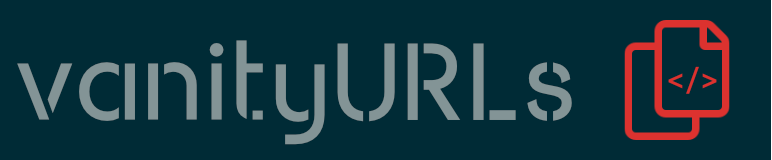

<h1 align="center">
   
  V8S.link
   
</h1>

This is an implementation of vanityURLs dedicated to 

is a _simple_ solution to deploy a budget-friendly Url Shortener. It runs at scale in your Cloudflare subscription with continuous integration.

> If you don't own an a Cloudflare subscription already, you can create your free account today so you can experience everything without spending a dime.

## Licence
**vanityURLs** is Copyright 2023 Benoît H. Dicaire and [licensed under the MIT licence](https://github.com/bhdicaire/vanityURLs/blob/master/LICENCE).
